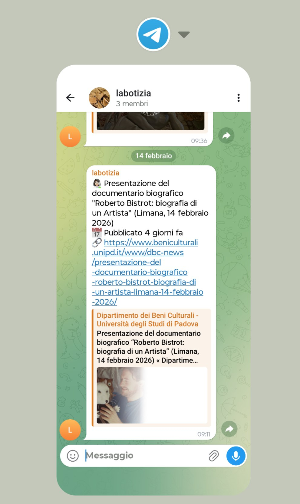
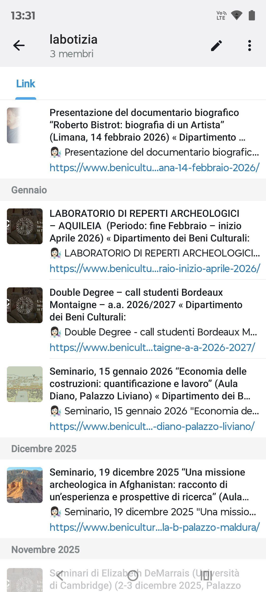

# Labotizia

This project automatically scrapes [laboratorio news](https://www.beniculturali.unipd.it/www/categoria/cdl/) from UNIPD dBC (dipartimento dei beni culturali, università degli studi di Padova) every morning and sends reminders to a [Telegram group](https://t.me/+u_XBkcUjcLRmMTVk) via a Telegram bot. It helps students who need laboratorio for tironcinio CFU to catch new registration info in time. 

## Quick Use

Just join the [Official Telegram group](https://t.me/+u_XBkcUjcLRmMTVk) of this project to get news.

<table>
   <tr>
      <td align="center"></td>
      <td align="center"></td>
   </tr>
</table>
The service has been running since 28 March 2025, and is still active as of February 2026 (date of this document update).

## Self Deployment

### With Github Actions

1. Fork or clone this repo to your GitHub account.
2. Go to `Settings` → `Secrets and variables` → `Actions` and add:
   - `TELEGRAM_BOT_TOKEN`: your Telegram bot token
   - `TELEGRAM_CHAT_ID`: your target group/channel chat_id
3. No extra setup needed. The included `.github/workflows/scraper.yml` will run the scraper and send news every day at 08:01 (Europe/Rome time).
4. You can manually trigger or check logs in Actions page.

### Other Deployment

You can make it yourself.

## License
MIT
